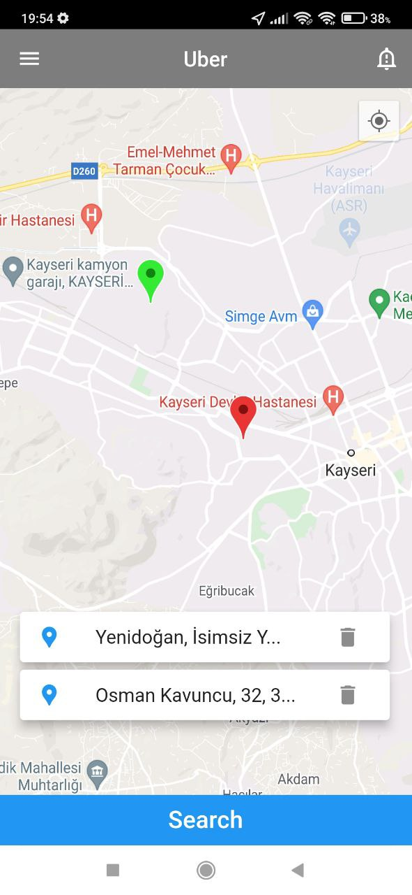
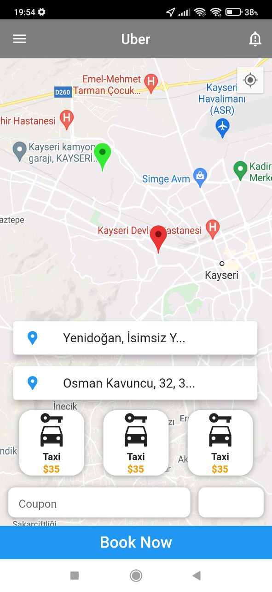
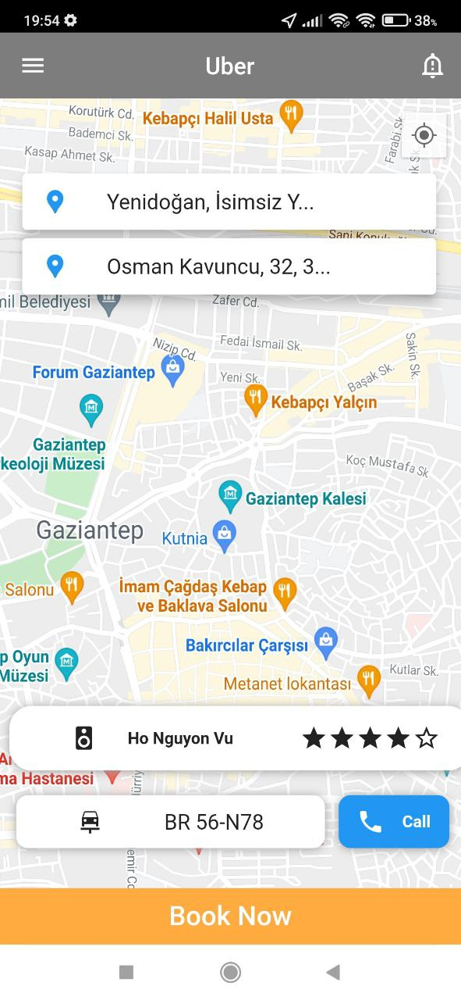

# FLUTTER/DART  UBER-REDESİGN-FİGMA GOOGLEMAP
-----------------------
You can find this Uİ Design on this Link
https://www.figma.com/file/zU1sxWHVzEbXKKJMUFXOJC/Uber-Redesign-Community
---------------------
## Used Packages

- google_map_flutter: 
- location: 
- permission_handler: 
- geocoding: 
- geolocator: 

git
## Screenshots

